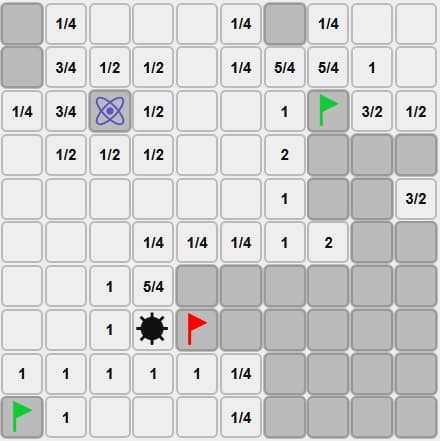

# Quantsweeper

[Play the game](https://danilakouzmenko.github.io/quantsweeper/)

**Short description:** Classic Minesweeper but with quantum mines - right in your browser.

[CHANGELOG](./changelog.md)

## Features
- Fully browser-based - no installation required
- Intuitive mouse and touch controls
- Responsive design for all devices

## Technologies

## Contributing
We welcome:
- Bug reports in **Issues**
- Feature ideas and suggestions